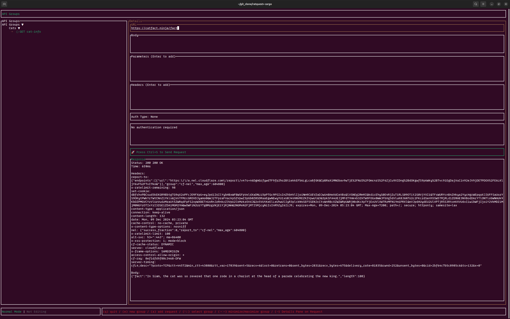

# 🐀 RatQuest

A delightful Terminal UI application for testing and managing your API requests with style! Built with Rust and love for developer productivity.



## ✨ Features

- 🌲 Intuitive tree-based organization of API requests
- 📦 Group your requests for better organization
- 🚀 Support for all major HTTP methods (GET, POST, PUT, DELETE, PATCH)
- 🔐 Built-in Basic Authentication support
- 📝 Easy-to-use parameter and header management
- 🎨 Beautiful TUI with syntax highlighting and visual feedback
- ⌨️ Vim-style keyboard navigation
- 🔄 Real-time response preview
- 📊 Response timing and status code visualization

## 🚀 Getting Started

### Prerequisites

Make sure you have Rust and Cargo installed on your system. If not, you can install them from [rust-lang.org](https://rust-lang.org).

### Installation

```bash
# Clone the repository
git clone https://github.com/username/ratquest.git

# Navigate to the project directory
cd ratquest

# Build and run the project
cargo run
```

## 🎮 Usage

### Keyboard Controls

#### Main Screen
- `q` - Quit application
- `e` - Create new group
- `a` - Add new request to selected group
- `↑/↓` - Navigate through groups/requests
- `←/→` - Minimize/maximize groups
- `Enter` - Open request details

#### Request Details Screen
- `Tab/Shift+Tab` - Navigate between fields
- `Ctrl+S` - Send request
- `Esc` - Return to main screen
- `Enter` - Add header/parameter when in respective sections

### Adding Requests

1. Select a group with arrow keys
2. Press `a` to add a new request
3. Enter request name
4. Choose request type with `←/→` keys
5. Press `Enter` to save

### Making Requests

1. Navigate to your request
2. Fill in URL, parameters, headers, and body as needed
3. Press `Ctrl+S` to send the request
4. View response details in the bottom panel

## 🛠 Technical Details

Built with these awesome Rust crates:
- `ratatui` - Terminal UI framework
- `crossterm` - Terminal manipulation
- `reqwest` - HTTP client
- `rat-tree-view` - Tree view component
- `tokio` - Async runtime

## 🤝 Contributing

Contributions are welcome! Here's how you can help:

1. Fork the repository
2. Create a feature branch (`git checkout -b feature/AmazingFeature`)
3. Commit your changes (`git commit -m 'Add some AmazingFeature'`)
4. Push to the branch (`git push origin feature/AmazingFeature`)
5. Open a Pull Request

## 📝 License

This project is licensed under the MIT License - see the [LICENSE](LICENSE) file for details.

## 🙋‍♂️ FAQ

**Q: Why the name RatQuest?**
A: Because every quest needs a trusty companion, and what better companion than a clever little rat to help you navigate the maze of API testing?

**Q: Can I save my requests?**
A: Not yet, but we're working on it! Stay tuned for updates.

**Q: Does it support environment variables?**
A: Not yet, but it's on our roadmap! Stay tuned for updates.

## 🎉 Acknowledgments

- Thanks to the Rust community for the amazing ecosystem
- Inspired by Postman and Insomnia, but with a terminal twist

---

Made with 🧀 by the RatQuest team
